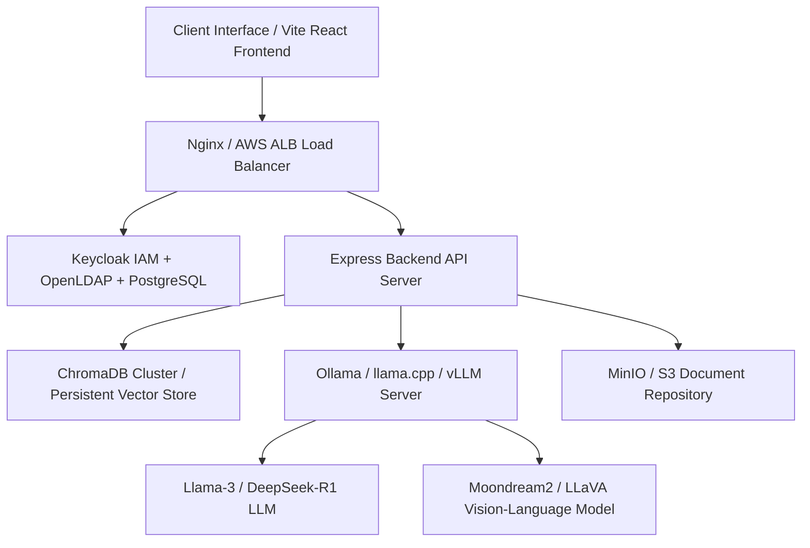

# IRSARGO Real-World Production Deployment & Cost Analysis (INR / ₹)

Comprehensive breakdown of hardware, cloud infrastructure, licensing, security, and operational costs required to deploy the **IRSARGO (ISRO Multi-Agent RAG Intelligence Platform)** in production across three deployment tiers.

*All costs are converted and calculated in **Indian Rupees (INR / ₹)** using an exchange benchmark of 1 USD = ₹86.00 INR.*

---

## 1. System Architecture & Resource Requirements

The IRSARGO platform consists of 5 core infrastructure layers:

### Resource Sizing Guidelines (per 50 Concurrent Users)
- **VLM / Multimodal Parsing**: Moondream2 / LLaVA (requires ~8GB VRAM per worker instance).
- **Primary LLM Swarm**: Llama-3-8B / Qwen-2.5-14B / DeepSeek-R1 14B Q4_K_M (requires 16GB–24GB VRAM).
- **ChromaDB Vector Store**: 100k document chunks (~32GB RAM + 500GB NVMe SSD).
- **Identity & Security**: Keycloak + OpenLDAP (4 vCPU, 8GB RAM).

---

## 2. Detailed Cost Breakdown by Deployment Model

### Model A: On-Premise Air-Gapped Bare Metal (Government / Defense / ISRO Mandate)
*Ideal for strict air-gapped security, zero external internet dependencies, and classified space telemetry datasets.*

| Component | Hardware Specifications | Setup Cost (CapEx) | Annual Maintenance / Power |
| :--- | :--- | :--- | :--- |
| **GPU Server (AI Engine)** | 2x NVIDIA L40S 48GB (or 2x A10G), 256GB RAM, 32-core AMD EPYC | ₹18,92,000 | ₹2,15,000 / year |
| **Application & Security Host**| 64-core EPYC, 128GB ECC RAM, 4TB NVMe Raid 10 | ₹5,59,000 | ₹68,800 / year |
| **Storage Appliance (MinIO)** | 48TB Enterprise NVMe NAS Storage Server | ₹4,73,000 | ₹51,600 / year |
| **Network & Air-Gap HSM** | 10GbE Switch, Hardware Security Module (HSM), Firewall | ₹6,88,000 | ₹86,000 / year |
| **Total Year 1 CapEx + OpEx** | **Capital Infrastructure Setup** | **₹36,12,000 (One-Time)** | **₹4,21,400 / Year** |

> **Cost Efficiency Summary (Year 2 onwards)**: **~₹35,116 / month** equivalent power & maintenance cost. Zero recurring cloud fees. **Total Year 1 Investment: ₹40.33 Lakhs.**

---

### Model B: Enterprise Dedicated Cloud (AWS Dedicated Instances & Private GPU)
*Ideal for high availability, automatic scaling, and enterprise SLA across regional divisions.*

| Service | Service Specification | Monthly Cost (INR) | Annual Cost (INR) |
| :--- | :--- | :--- | :--- |
| **GPU Node (Ollama / vLLM)** | AWS EC2 `g5.2xlarge` (1x NVIDIA A10G 24GB VRAM, 8 vCPU, 32GB RAM) | ₹75,680 | ₹9,08,160 |
| **Application & API Server** | AWS EC2 `t4g.xlarge` (4 vCPU Graviton3, 16GB RAM) | ₹8,428 | ₹1,01,136 |
| **Keycloak + DB Server** | AWS RDS PostgreSQL (`db.m6g.large`, Multi-AZ) | ₹15,480 | ₹1,85,760 |
| **ChromaDB Vector Node** | AWS EC2 `m6i.2xlarge` (8 vCPU, 32GB RAM, 1TB EBS GP3 SSD) | ₹27,520 | ₹3,30,240 |
| **Document Storage & Vault**| AWS S3 Standard (2TB storage + data transfer) | ₹4,730 | ₹56,760 |
| **Load Balancing & WAF** | AWS ALB + AWS WAF Security Rules | ₹8,170 | ₹98,040 |
| **Total Cloud Expense** | **On-Demand Elastic Cloud Architecture** | **₹1,40,008 / Month** | **₹16,80,096 / Year** |

> **Savings Tip**: Reserved Instances (3-Year Savings Plan) reduce AWS compute costs by **38%–52%**, bringing monthly cloud spend to **~₹84,280 / month (~₹10.11 Lakhs / year)**.

---

### Model C: Cost-Optimized Startup / Demo Hosting (Cloud GPU Provider + Shared VPC)
*Ideal for pilot testing, demonstration environments, and team evaluations.*

| Service | Provider & Instance Type | Monthly Cost (INR) | Annual Cost (INR) |
| :--- | :--- | :--- | :--- |
| **GPU Inference (Ollama/VLM)** | RunPod / Lambda Labs (1x RTX 4090 24GB or A4000) | ₹22,360 | ₹2,68,320 |
| **API Backend & Keycloak** | Hetzner Cloud `CPX31` (4 vCPU, 8GB RAM, 160GB NVMe) | ₹1,376 | ₹16,512 |
| **Vector DB & Storage** | Shared VPS Server / Hetzner Storage Box 1TB | ₹2,150 | ₹25,800 |
| **Domain & SSL/CDN** | Cloudflare Pro + Domain DNS | ₹1,720 | ₹20,640 |
| **Total Pilot Spend** | **Minimal Monthly Production Baseline** | **₹27,606 / Month** | **₹3,31,272 / Year** |

---

## 3. Operational & Licensing Costs

1. **Software Licensing**:
   - **Keycloak IAM**: ₹0 (Open Source Apache 2.0).
   - **ChromaDB**: ₹0 (Self-Hosted Open Source).
   - **Ollama / llama.cpp**: ₹0 (Open Source MIT).
   - **Moondream2 / Llama 3 / Qwen 2.5**: ₹0 (Open Weights / Commercial Permissive).

2. **Maintenance & DevOps Labor (Estimated FTE)**:
   - **Infrastructure / Security Monitoring**: 5–10 hours/month (**₹43,000 – ₹86,000 / month**).
   - **Model Quantization & Vector Re-indexing Updates**: 4 hours/month.

---

## 4. Summary & Recommendation Matrix

| Deployment Scale | Year 1 Initial Setup Cost | Recurring Monthly Cost | Best Suited For |
| :--- | :--- | :--- | :--- |
| **Air-Gapped Bare Metal** | **₹40.33 Lakhs** *(CapEx + OpEx)* | **~₹35,116 / month** | Defense, ISRO, Classified Air-Gapped Datasets |
| **AWS Dedicated Cloud** | **₹16.80 Lakhs / year** | **₹1,40,008 / month** | Enterprise Production (Elastic Auto-scaling) |
| **AWS Reserved Cloud (3-Yr)**| **₹10.11 Lakhs / year** | **₹84,280 / month** | Sustained Production Workloads |
| **Pilot / Startup Cloud** | **₹3.31 Lakhs / year** | **₹27,606 / month** | Prototyping, Internal Testing, Demos |
