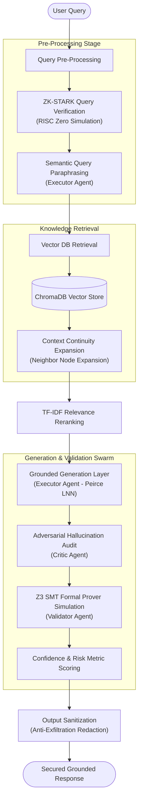

# IRSARGO: Zero-Trust Multi-Agent RAG Engine

**IRSARGO** (Secure and Accurate Retrieval-Augmented Generation for Aerospace & Government Compliance) is a mission-critical, self-contained RAG system tailored for Indian Space Research Organisation (ISRO) aerospace technical specifications and government procurement guidelines (GFR 2017). 

Designed to operate in secure, air-gapped environments, the system features a zero-trust multi-agent security pipeline, local embedding computation, dynamic access control lists (DACL), anti-exfiltration output filtering, and simulated hybrid formal verification (ZK-STARK + Z3 SMT) to guarantee groundedness and data safety.

---

## 🚀 Core Features

### 1. Zero-Trust Security Stack
*   **Input Sanitization**: Automatically strips zero-width spaces, hidden control characters, and HTML/markdown comments to block invisible instruction injection and smuggling attacks.
*   **PII Redaction Engine**: Automatically redacts emails, phone numbers, and Security Identifiers (SIDs) prior to vector database storage, logging them in a secure local `pii_mappings.json` file for local, reversible reference.
*   **Anti-Exfiltration Output Filter**: Validates all generated links and image renders against the retrieved source node metadata. Unrecognized URLs or potential image exfiltration vectors are blocked or redacted.
*   **Dynamic Access Control (DACL)**: Enforces role-based data security (Administrator, Operator, Guest). Confidential documents are tagged with ACL properties to restrictGuest clearance level queries from returning unauthorized chunks.

### 2. Multi-Agent Swarm Orchestrator
Uses specialized agents to coordinate queries, review responses, and perform formal audits:
*   **Validator (Query Stage)**: Simulates RISC Zero zkVM query validation to authenticate the query integrity and local offline node provenance.
*   **Executor (Paraphraser)**: Protects context by securely paraphrasing user inputs into clean semantic search parameters, neutralizing direct prompt injections.
*   **Executor (Generation - Peirce LNN)**: Generates detailed, technical responses using Logical Neural Network structural XML delimiters (`<grounding_context>`).
*   **Critic (Adversarial Audit)**: Adversarially audits responses against the retrieved context to flag potential hallucinations, logic flaws, or injection leaks.
*   **Validator (Verification Stage)**: Computes confidence metrics and performs constraint checking.

### 3. Verification & Compliance Proving
*   **Z3 SMT Solver Simulation**: Performs formal verification checks on constraints extracted from the retrieved nodes, verifying that the generated answer conforms strictly to source documents.
*   **RAG Triad Confidence Scoring**: Real-time evaluation of:
    *   *Retrieval Accuracy*: Semantic relevance score of ChromaDB nodes.
    *   *Grounding Fidelity*: Prover-verified ratio of context grounding constraints.
    *   *Hallucination Risk*: Probability of ungrounded technical declarations.
    *   *Overall Confidence*: Unified score indicating response trustworthiness.
*   **C2PA Provenance Tracking**: Uploaded documents are hashed (SHA-256) and verified, maintaining audit trails in `ingestion_audit.log`.

---

## 📐 Architecture Flow



---

## 📂 Codebase Directory Structure

```text
├── chroma_data/             # Local persistent directory for ChromaDB database files
├── datasets/                # Source directory for document ingestion (PDF, TXT, MD, CSV)
├── server/
│   └── index.ts             # Express.js backend API server handling RAG endpoints
├── scripts/
│   ├── ingest.ts            # Text extraction, local chunking, embedding, & indexing script
│   └── verify_ingest.ts     # Verification utility to audit ChromaDB collections and counts
├── src/
│   ├── components/          # React layout components (GraphVisualizer, TraceAudit, etc.)
│   ├── lib/
│   │   ├── agents.ts        # Orchestration layer for the multi-agent pipeline
│   │   ├── ontology.ts      # Client-side fallback dataset definition and API endpoints
│   │   └── verify.ts        # Client-side verification utilities and confidence metrics
│   ├── App.tsx              # Main dashboard wrapper and view switcher
│   ├── index.css            # Stylesheets using modern, dark-theme styles
│   └── main.tsx             # Application entrypoint
├── docker-compose.yml       # Docker orchestrator for ChromaDB and offline ingest containers
├── ingest.Dockerfile        # Docker environment for running the ingestion pipeline
├── package.json             # Core dependency configuration and NPM scripts
└── tsconfig.json            # TypeScript compiler options
```

---

## ⚙️ Environment Variables Configuration

To configure the application, create a `.env.local` file in the root directory (based on `.env.example`):

| Variable | Description | Default / Example Value |
| :--- | :--- | :--- |
| `GEMINI_API_KEY` | Google Gemini API key used for generation (if cloud is allowed) | `AIzaSy...` |
| `APP_URL` | Application endpoint URL | `http://localhost:3000` |
| `USE_LOCAL_LLM` | Set `true` to run generation on a local offline model | `false` |
| `LOCAL_LLM_URL` | API endpoint for the local LLM instance | `http://localhost:11434` |
| `LOCAL_LLM_MODEL` | The model name in the local LLM instance (e.g. Ollama) | `gemma2:2b` |
| `CHROMADB_HOST` | Hostname of the ChromaDB database service | `localhost` |
| `CHROMADB_PORT` | Port of the ChromaDB database service | `8000` |
| `CHROMADB_SSL` | Enable SSL for ChromaDB connections | `false` |

> [!NOTE]
> When executing in fully air-gapped / offline modes, ensure that `USE_LOCAL_LLM` is set to `"true"`, and ChromaDB is running locally via Docker or a native service.

---

## 🛠️ Getting Started & Run Locally

### Prerequisites
*   **Node.js** (v18 or higher recommended)
*   **Docker** and **Docker Compose** (for vector storage)

### Step 1: Install Dependencies
Install packages for both frontend UI components and the backend server:
```bash
npm install
```

### Step 2: Launch ChromaDB Vector Database
Start the persistent ChromaDB service using Docker Compose:
```bash
docker-compose up -d chromadb
```
This launches a database container on `http://localhost:8000` mapped to `./chroma_data` on the host machine.

### Step 3: Populate Datasets & Run Ingestion
1. Place the documents you want to ingest (PDF, TXT, MD, or CSV) in the `datasets/` folder.
2. Ingest the documents into ChromaDB. During ingestion, text is read, sanitized, redacted of PII, and converted into local vector embeddings using Xenova's `@xenova/transformers` library (running `all-MiniLM-L6-v2` locally):

**Option A (Using Docker Ingestion Container):**
```bash
docker-compose run --rm ingest
```

**Option B (Using Local Node Script):**
```bash
npm run ingest
```

### Step 4: Verify Ingestion Success
To verify the documents were successfully loaded into ChromaDB, run the verification script:
```bash
npx tsx scripts/verify_ingest.ts
```
This prints the database connection status, item count, and sample indexed entries.

### Step 5: Start the Backend Server
Start the Express API server (runs on `http://localhost:3001`):
```bash
npm run server
```

### Step 6: Start the Frontend App
Start the Vite developer client server:
```bash
npm run dev
```
Open `http://localhost:3000` in your web browser to access the dashboard.

---

## 🛡️ Security Details & DACL Matrix

### clearance and authorization levels
*   **Administrator**: Resolved SIDs: `admin, everyone`. Full clearance to both public and confidential/secret documents.
*   **Operator**: Resolved SIDs: `everyone`. Standard user clearance. Restricted from indexing or querying confidential/secret documents.
*   **Guest**: Resolved SIDs: `guest, everyone`. Subject to active exfiltration checks, strict document denials, and link redaction filters.

### Dynamic Access Control Logic
During ingestion, if a filename or content contains labels like `secret` or `confidential`, it is flagged with access metadata:
```json
{
  "allowed_groups": "admin",
  "denied_groups": "guest"
}
```
Queries made by users assigned to different roles will automatically inject group-filtering clauses in ChromaDB:
*   Users without `admin` roles cannot fetch chunks marked `allowed_groups: admin`.
*   Users matching `guest` roles are filtered out from retrieving chunks marked `denied_groups: guest`.

---

## 🛠️ Verification Console
The IRSARGO Console provides tabs for:
1.  **Console**: Standard chatbot interface with live tracking of the agent swarm's execution steps and the validation metrics dashboard.
2.  **Nodes (Database)**: Dynamic graph-based and tabular visualization of chunk relations and database parameters.
3.  **Ingest**: Web interface to upload documents and log automated C2PA SHA-256 provenance hashes.
4.  **History**: Persistent log of previous query outcomes.
5.  **Data Export**: Export grounded answers and traces into structured JSON audits.
