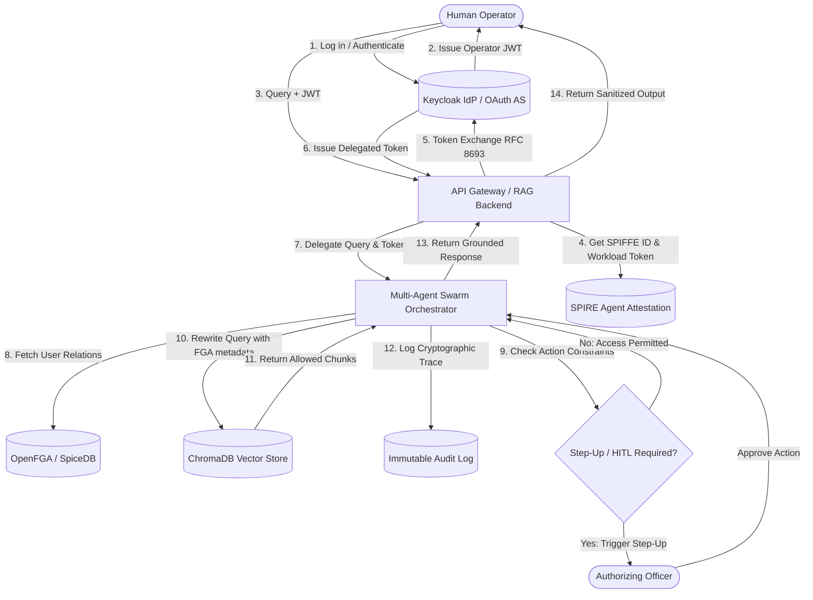
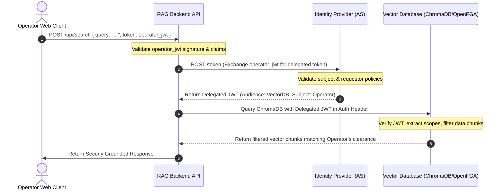
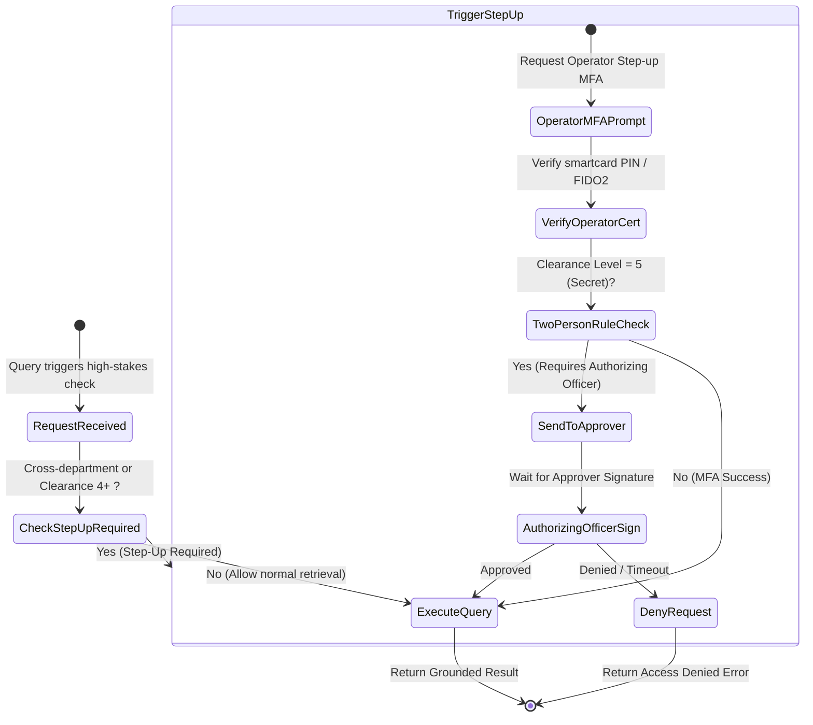

# IRSARGO: Zero-Trust Identity, Authentication, and Fine-Grained Authorization (FGA) Architecture

This document defines the production-grade Zero-Trust Security Architecture for **IRSARGO**, a mission-critical, self-contained Retrieval-Augmented Generation (RAG) system operating in sensitive, air-gapped environments. This specification covers authentication, relationship-based fine-grained authorization (ReBAC), delegated identity passthrough, agent workload security, and cryptographically verified audit logging.

---

## 1. High-Level Zero-Trust Security Architecture

In a secure air-gapped environment (e.g., NIC/ISRO private networks), perimeter defense is insufficient. The IRSARGO architecture enforces a **Zero-Trust Retrieval Pipeline** where every human operator, orchestration agent, and verification workload must be explicitly authenticated, and every access request must be dynamically authorized at the data-chunk level.

### System Architecture Flow



---

## 2. Core Authentication & Identity Control Plane

To maintain maximum autonomy and security compliance in air-gapped networks, identity control is unified under an local Identity Provider (IdP) supporting **OpenID Connect (OIDC)** and **SAML 2.0** (e.g., Keycloak or Shibboleth running on dedicated secure nodes).

### 2.1 Unified Identity Management (Human vs. Non-Human)
IRSARGO treats **Human Operators** and **AI Workloads (Agents)** as distinct subclasses of a single unified Identity Control Plane.

1. **Human Operators**: Bound to real-world government/agency directory entries (e.g., Active Directory / OpenLDAP) synchronized with Keycloak. Authentication requires multi-factor credentials (PKI Smartcards / FIDO2 tokens in offline mode).
2. **Non-Human Identities (AI Agents)**: Registered as Service Accounts with strict, non-interactive OAuth 2.0 client profiles. Rather than static client secrets, their identities are attested and issued short-lived tokens via a local SPIFFE/SPIRE daemon.

### 2.2 Unified Identity JSON Schema
The following JSON schema defines the identity metadata standard carried in JWT claims, establishing unified classification and clearance tracking:

```json
{
  "$schema": "https://json-schema.org/draft/2020-12/schema",
  "title": "IRSARGOIdentityClaims",
  "type": "object",
  "properties": {
    "sub": {
      "type": "string",
      "description": "Unique subject identifier (UUID or attested SPIFFE ID)"
    },
    "identity_type": {
      "type": "string",
      "enum": ["HUMAN_OPERATOR", "AI_AGENT", "SYSTEM_SERVICE"]
    },
    "clearance_level": {
      "type": "integer",
      "minimum": 1,
      "maximum": 5,
      "description": "Clearance: 1 (Unclassified/Public) to 5 (Top Secret / Secret)"
    },
    "departments": {
      "type": "array",
      "items": { "type": "string" },
      "description": "Org units: e.g., ['PROPULSION', 'AVIONICS']"
    },
    "roles": {
      "type": "array",
      "items": { "type": "string" },
      "description": "RBAC roles: e.g., ['Lead_Engineer', 'Auditor']"
    },
    "projects": {
      "type": "array",
      "items": { "type": "string" },
      "description": "Specific project scopes: e.g., ['GSAT-24', 'ADITYA-L1']"
    },
    "attestation": {
      "type": "object",
      "properties": {
        "method": { "type": "string", "enum": ["PKI_SMARTCARD", "SPIRE_TPM2", "MUTUAL_TLS"] },
        "trust_domain": { "type": "string" }
      },
      "required": ["method"]
    }
  },
  "required": ["sub", "identity_type", "clearance_level", "departments", "roles", "projects"]
}
```

---

## 3. Identity Passthrough & Delegated Authorization

A critical vulnerability in RAG systems is the "Superadmin Agent" pattern: an AI Agent executing vector database queries using root service credentials, manually filtering the output. This is prone to prompt injection bypasses. IRSARGO implements **Identity Passthrough** (On-Behalf-Of Authorization).

### 3.1 Token Exchange (RFC 8693) Flow
The RAG backend API exchanges the Operator's OIDC access token for a downscoped, user-delegated vector database access token via the Keycloak Token Exchange endpoint. The AI agent retrieves vectors by presenting this delegated token, forcing the Vector DB to evaluate queries under the operator's security footprint.



### 3.2 Token Exchange & Fallback Implementation
Below is the TypeScript backend implementation for verifying the operator's credentials, performing the RFC 8693 token exchange, and enforcing **graceful degradation** (falling back to a minimal privilege role and alerting SIEM) if the token exchange process fails.

```typescript
import jwt from 'jsonwebtoken';
import fetch from 'node-fetch';

interface UserIdentity {
  sub: string;
  identity_type: 'HUMAN_OPERATOR' | 'AI_AGENT';
  clearance_level: number;
  departments: string[];
  roles: string[];
  projects: string[];
}

interface DelegatedCredentials {
  accessToken: string;
  isFallback: boolean;
}

const IDP_TOKEN_EXCHANGE_URL = process.env.IDP_TOKEN_EXCHANGE_URL || 'https://keycloak.internal/auth/realms/isro/protocol/openid-connect/token';
const DEGRADED_SERVICE_TOKEN = process.env.DEGRADED_SERVICE_TOKEN || 'fallback-restricted-guest-token';
const RETRY_ATTEMPTS = 3;

/**
 * Triggers a critical SIEM audit alert for operational anomalies.
 */
function sendSIEMAlert(message: string, context: Record<string, any>) {
  const alertPayload = {
    timestamp: new Date().toISOString(),
    severity: 'CRITICAL',
    event_type: 'DELEGATED_AUTH_FAILURE',
    message,
    metadata: context,
  };
  // In an air-gapped system, write to a designated local secure syslog endpoint
  console.error(`[SIEM ALERT] ${JSON.stringify(alertPayload)}`);
}

/**
 * Executes RFC 8693 Token Exchange with Keycloak
 */
async function exchangeToken(operatorToken: string): Promise<string> {
  const params = new URLSearchParams();
  params.append('grant_type', 'urn:ietf:params:oauth:grant-type:token-exchange');
  params.append('client_id', 'IRSARGO-rag-backend');
  // In production, authenticates via SPIFFE mTLS rather than static client secrets
  params.append('subject_token', operatorToken);
  params.append('subject_token_type', 'urn:ietf:params:oauth:token-type:access_token');
  params.append('requested_token_type', 'urn:ietf:params:oauth:token-type:access_token');
  params.append('audience', 'IRSARGO-vector-db');

  const response = await fetch(IDP_TOKEN_EXCHANGE_URL, {
    method: 'POST',
    headers: { 'Content-Type': 'application/x-www-form-urlencoded' },
    body: params,
    timeout: 3000,
  });

  if (!response.ok) {
    throw new Error(`Token exchange rejected: ${response.statusText}`);
  }

  const data = await response.json();
  return data.access_token;
}

/**
 * Resolves a delegated credential wrapper. Enforces graceful degradation to guest clearance.
 */
export async function getDelegatedDbCredentials(
  operatorToken: string,
  operatorId: string
): Promise<DelegatedCredentials> {
  let attempt = 0;
  while (attempt < RETRY_ATTEMPTS) {
    try {
      attempt++;
      const delegatedToken = await exchangeToken(operatorToken);
      return {
        accessToken: delegatedToken,
        isFallback: false,
      };
    } catch (error) {
      console.warn(`[AUTH] Token exchange attempt ${attempt} failed: ${error instanceof Error ? error.message : error}`);
      if (attempt >= RETRY_ATTEMPTS) {
        break;
      }
      // Wait for backoff
      await new Promise((r) => setTimeout(r, 150 * attempt));
    }
  }

  // Graceful Degradation: Trigger SIEM alert and fallback to guest profile
  sendSIEMAlert('Identity Passthrough Token Exchange failed after maximum retries. Degrading to guest service token.', {
    user: operatorId,
    timestamp: new Date().toISOString(),
    action: 'RETRIEVAL_DELEGATION'
  });

  return {
    accessToken: DEGRADED_SERVICE_TOKEN,
    isFallback: true,
  };
}
```

---

## 4. Vector Database Access Control (Retrieval-Level Security)

Retrieval-Level Security mandates that authorization happens *within* the database search index. Post-retrieval filtering (fetching data first, then discarding what the user can't see) is a critical anti-pattern: it wastes context window space and leaks sensitive information via search latency metrics or cached vector spaces.

### 4.1 Multi-Tenant Isolation Strategy

| Strategy | Compliance Level | Timing/Vector Leakage Resistance | Operational Overhead | Recommendation |
| :--- | :--- | :--- | :--- | :--- |
| **Instance-per-Tenant** | Extremely High | Complete | Extremely High (Hardware heavy) | Used for separating defense departments (e.g., military vs civil space). |
| **Index-per-Classification** | High | High (Prevents high-to-low leaks) | Medium | **Recommended** for segregating classification tiers (Secret vs Public). |
| **Metadata Filtering** | Medium-High | Low (Vulnerable to timing side-channels) | Low | **Recommended** for compartmented projects (e.g., GSAT vs Aditya) within the same classification. |

**IRSARGO Hybrid Model**: 
We utilize **Index-per-Classification** (separate Chroma collections for `SECRET`, `CONFIDENTIAL`, and `PUBLIC`) combined with **Metadata Namespace Isolation** within each collection for departments and projects.

### 4.2 Mapping RBAC and ReBAC to Vector Metadata
To query the database, a query's metadata filter is rewritten at runtime by intersecting the operator's **Clearance** (RBAC) with their **Relationships** (ReBAC, resolved via OpenFGA / SpiceDB).

#### Schema of Ingested Vector Chunks:
```json
{
  "document_id": "doc-09827",
  "text": "Propulsion telemetry specification detail...",
  "metadata": {
    "classification": "SECRET",
    "department_owner": "PROPULSION",
    "project_id": "GSAT-24",
    "allowed_groups": "admin,propulsion-leads",
    "denied_groups": "guest,external-auditors",
    "provenance_hash": "e3b0c44298fc1c149afbf4c8996fb92427ae41e4649b934ca495991b7852b855"
  }
}
```

### 4.3 OpenFGA (ReBAC) Configuration Schema
OpenFGA defines relationships dynamically. Below is the configuration schema written in OpenFGA DSL:

```fga
model
  schema 1.1

type user

type department
  relations
    define member: [user]

type project
  relations
    define member: [user]
    define owner: [department]
    define viewer: member or owner#member

type document
  relations
    define parent_project: [project]
    define allowed_viewer: [user] or viewer from parent_project
    define restricted_access: [user]
    define can_view: allowed_viewer and not restricted_access
```

### 4.4 Dynamic Query Rewriting Implementation
The following function intercepts incoming queries, resolves the operator's relationships from OpenFGA, and rewrites the database query to inject strict `$and` filtering conditions.

```typescript
import { ChromaClient } from 'chromadb';

interface UserFgaContext {
  userId: string;
  clearanceLevel: number; // 1 to 5
  departments: string[];
}

// Simulated OpenFGA client integration
async function getAuthorizedProjectsFromFga(userId: string): Promise<string[]> {
  // In production, queries the OpenFGA HTTP API:
  // POST /stores/IRSARGO/check or POST /stores/IRSARGO/read-user-relations
  // Returns list of projects where user has 'viewer' relation
  if (userId === 'operator-007') {
    return ['GSAT-24', 'LVM3-M4'];
  }
  return ['PUBLIC-DATA'];
}

/**
 * Rewrites a query schema to inject mandatory access-control metadata filters
 */
export async function queryChromaWithFga(
  chromaClient: ChromaClient,
  collectionName: string,
  queryText: string,
  queryEmbedding: number[],
  userCtx: UserFgaContext
): Promise<any[]> {
  
  // 1. Resolve authorized project IDs from ReBAC engine
  const authorizedProjects = await getAuthorizedProjectsFromFga(userCtx.userId);
  
  // 2. Build ChromaDB compound filter conditions
  const andConditions: any[] = [];
  
  // Rule A: Limit by operator's department affiliations
  if (userCtx.departments.length > 0) {
    const deptConditions = userCtx.departments.map(dept => ({ department_owner: dept }));
    if (deptConditions.length === 1) {
      andConditions.push(deptConditions[0]);
    } else {
      andConditions.push({ $or: deptConditions });
    }
  }

  // Rule B: Limit by projects operator has a ReBAC relation with
  if (authorizedProjects.length > 0) {
    const projConditions = authorizedProjects.map(proj => ({ project_id: proj }));
    if (projConditions.length === 1) {
      andConditions.push(projConditions[0]);
    } else {
      andConditions.push({ $or: projConditions });
    }
  }

  // Rule C: Ensure strict clearance level hierarchy (data classification level <= user clearance level)
  andConditions.push({
    classification_clearance_required: { $lte: userCtx.clearanceLevel }
  });

  // Construct final compound ChromaDB where clause
  let fgaWhereClause: any = undefined;
  if (andConditions.length === 1) {
    fgaWhereClause = andConditions[0];
  } else if (andConditions.length > 1) {
    fgaWhereClause = { $and: andConditions };
  }

  const collection = await chromaClient.getCollection({ name: collectionName });
  
  // 3. Execute semantic search with mandatory metadata filter injected
  const results = await collection.query({
    queryEmbeddings: [queryEmbedding],
    nResults: 5,
    where: fgaWhereClause,
  });

  // Transform results into normalized layout
  const nodes: any[] = [];
  if (results.ids && results.ids[0]) {
    for (let i = 0; i < results.ids[0].length; i++) {
      nodes.push({
        id: results.ids[0][i],
        content: results.documents?.[0][i] || '',
        metadata: results.metadatas?.[0][i] || {},
        distance: results.distances?.[0][i] || 0
      });
    }
  }

  return nodes;
}
```

---

## 5. Agentic Security & Zero Standing Privileges (ZSP)

AI orchestration agents can easily become high-value targets for attackers. Therefore, agents operate under the principle of **Zero Standing Privileges (ZSP)**: they have no permanent, static database credentials.

### 5.1 SPIFFE/SPIRE for Agent Workload Identity
In air-gapped environments, the system utilizes **SPIFFE/SPIRE** (Secure Production Identity Framework for Enterprise) for attesting agent workloads. 

```mermaid
flowchart LR
    subgraph Trusted Control Plane
        SpireServer[SPIRE Server]
    end
    subgraph Agent Node (K8s/Docker)
        SpireAgent[SPIRE Agent]
        LnnAgent[LNN Peirce Generation Agent]
    end

    LnnAgent -->|1. Attest / Fetch Identity| SpireAgent
    SpireAgent -->|2. Verify Process Metadata (PID, UID, Hash)| SpireServer
    SpireServer -->|3. Issue cryptographically signed SVID| SpireAgent
    SpireAgent -->|4. Deliver SVID (X.509 Certificate / JWT)| LnnAgent
```

1. Each agent process connects to the local **SPIRE Agent** socket upon startup.
2. SPIRE performs system-level attestation (verifying the process binary hash, container namespace, and Linux UID/GID).
3. Once attested, the agent is issued a **SPIFFE Verifiable Identity Document (SVID)** in the form of a short-lived X.509 certificate or JWT containing its SPIFFE ID:
   `spiffe://IRSARGO.isro.internal/ns/default/sa/peirce-generation-agent`

### 5.2 Just-in-Time (JIT) Data Access & Ephemeral Token Generation
Access to vector indexes is granted on a **Just-in-Time (JIT)** basis, restricted strictly to the duration of the current execution trace (default expiration: **60 seconds**).

#### Ephemeral Token Generation Flow:
1. The **Orchestrator** receives a validated query from the Human Operator.
2. The Orchestrator calls the Authorization Server, requesting a JIT Session token.
3. The Authorization Server mints a task-scoped JWT containing the operator's delegated constraints, the requesting agent's SPIFFE SVID, and a cryptographically signed expiration timestamp set to `now + 60s`.
4. The Agent executes the task and queries the vector index using this temporary token.
5. Once the task finishes, the token expires, returning the agent back to zero database access privileges.

---

## 6. Auditing, Traceability, & Human-in-the-Loop (HITL)

Highly sensitive aerospace operations require complete traceability. In IRSARGO, logs are designed to be cryptographically verified and immutable.

### 6.1 Cryptographically Linked Audit Logging
Every retrieval trace is recorded in a structured JSON audit ledger. The ledger uses a block-like hash chain where each log entry contains a SHA-256 hash of the previous entry, preventing retro-active tampering of the logs in offline filesystems.

```json
{
  "log_sequence": 10427,
  "previous_entry_hash": "9b7d8c2e64ef81329a1bb2345fe92a188f121d960f64f3312c4ea092aef34f19",
  "timestamp": "2026-07-16T00:19:05Z",
  "request_context": {
    "user_id": "usr-8832-isro",
    "user_clearance": 4,
    "user_departments": ["AVIONICS"],
    "query_text": "Retrieve fuel tank structural stress equations for GSLV Mk III payload bay."
  },
  "agent_workloads": {
    "orchestrator_agent_spiffe": "spiffe://IRSARGO.isro/sa/orchestrator-agent",
    "generation_agent_spiffe": "spiffe://IRSARGO.isro/sa/peirce-lnn-agent"
  },
  "retrieval_trace": {
    "vector_collection": "aerospace_secret",
    "query_embedding_sha256": "4b68e980a321cf724589d1b64e031e46",
    "retrieved_chunks": [
      {
        "chunk_id": "gslv-stress-specs-upload-4-0928a",
        "provenance_hash": "c2pa_hash_f8e32901abcf89",
        "document_name": "gslv_stress_specifications_secret.pdf",
        "similarity_score": 0.942
      }
    ]
  },
  "output_verification": {
    "hallucination_risk_score": 0.02,
    "formal_verifier_status": "Z3_SMT_PROVED",
    "anti_exfiltration_logs": {
      "blocked_links_count": 0,
      "redacted_pii_count": 2
    }
  },
  "signature": "MEQCIFm5s/Y1K9Fp2i67RZw...[Cryptographic Signature from HSM / KMS]"
}
```

### 6.2 Human-in-the-Loop (HITL) & Step-up MFA Workflows
High-stakes administrative or cross-departmental operations (e.g., requesting technical documents from a project the operator is not associated with, or exporting secret telemetry vectors) trigger step-up verification.



#### Step-up Workflow Trigger Configuration (YAML):
```yaml
security_policies:
  system_node: "NIC_SECURED_NODE_882"
  default_max_clearance: 3
  
  step_up_triggers:
    - name: "Cross-Department Access"
      condition: "user.departments != document.department_owner"
      action: "REQUIRE_STEP_UP_MFA"
      mfa_methods:
        - "PKI_SMARTCARD"
        - "FIDO2_OFFLINE"
        
    - name: "High Clearance Retrieval"
      condition: "document.clearance_level >= 4"
      action: "REQUIRE_TWO_MAN_RULE"
      approver_role: "Authorizing_Officer"
      validity_window_seconds: 300
      
    - name: "Export Payload Bay Vectors"
      condition: "query.contains('payload_bay') && user.clearance_level < 5"
      action: "DENY_IMMEDIATELY"
      log_severity: "CRITICAL"
```
